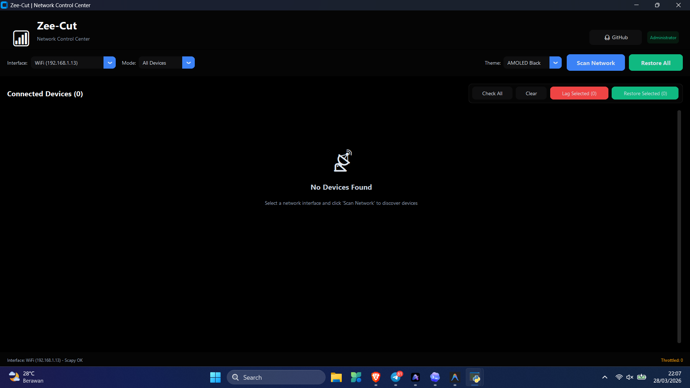
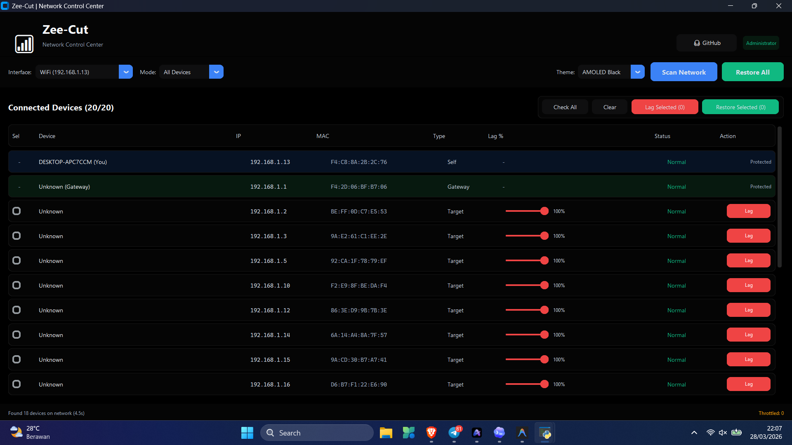

<p align="center">
  <h1 align="center">🔌 Zee-Cut</h1>
  <p align="center">
    <strong>Advanced WiFi Network Device Controller</strong>
  </p>
  <p align="center">
    A powerful, modern desktop application for managing and controlling devices connected to your WiFi network. Throttle or normalize internet access for any device with a single click.
  </p>
  <p align="center">
    <a href="#features"></a>
    <a href="#tech-stack"></a>
    <a href="#"></a>
    <a href="LICENSE"></a>
  </p>
</p>

---

## 📖 Overview

**Zee-Cut** is a network management tool inspired by NetCut, built with Python and a modern dark-themed GUI. It allows you to scan your local WiFi network for connected devices and control their internet access using ARP-based traffic management.

Whether you need to limit bandwidth-hogging devices or manage network access on your own WiFi, Zee-Cut provides an intuitive, one-click solution.

> **⚠️ Legal Notice:** This tool is designed exclusively for use on networks you own and administer. Unauthorized use on networks you do not own is illegal and unethical. The developers assume no liability for misuse.

---

## ✨ Features

| Feature | Description |
|---------|-------------|
| 🔍 **Network Scanning** | Multi-method device discovery (ARP table, ping sweep, Scapy ARP broadcast) |
| 🚫 **Device Throttling** | Slow down or completely block internet access for any device via ARP spoofing |
| ✅ **One-Click Restore** | Instantly restore normal connectivity for throttled devices |
| 📋 **Device Information** | View IP address, MAC address, and hostname for every connected device |
| 🛡️ **Auto-Elevation** | Automatically requests Administrator privileges on launch |
| 🎨 **Modern Dark UI** | Sleek, dark-themed interface built with CustomTkinter |
| 📦 **Portable EXE** | Single-file executable — no installation required |
| 🔄 **Safe Cleanup** | Automatically restores all devices when the application is closed |

---

## 🖼️ Screenshots

<p align="center">
  
</p>

<p align="center">
  
</p>

---

## 🚀 Getting Started

### Prerequisites

Before using Zee-Cut, ensure you have the following installed:

1. **Python 3.10+** — [Download Python](https://www.python.org/downloads/)
2. **Npcap** (Required for network scanning)
   - [Download Npcap](https://npcap.com/#download)
   - During installation, check ✅ **"Install Npcap in WinPcap API-compatible mode"**

### Installation

```bash
# Clone the repository
git clone https://github.com/ifauzeee/Zee-Cut.git
cd Zee-Cut

# Install Python dependencies
pip install -r requirements.txt
```

### Running the Application

#### Option 1: Run with Python
```bash
python main.py
```

#### Option 2: Use the run script
```bash
run.bat
```

#### Option 3: Use the pre-built executable
Download `Zee-Cut.exe` from the [Releases](https://github.com/ifauzeee/Zee-Cut/releases) page, then right-click → **Run as Administrator**.

> **Note:** Administrator privileges are required for ARP operations. The application will prompt for elevation automatically.

### Running Tests

```bash
python -m unittest discover -s tests -v
```

---

## 📖 Usage Guide

1. **Launch** — Run the application as Administrator
2. **Select Interface** — Choose your WiFi adapter from the dropdown menu
3. **Scan Network** — Click `🔍 Scan Network` to discover all connected devices
4. **Throttle** — Click `🚫 Lag Device` on any device card to throttle its connection
5. **Restore** — Click `✅ Normalkan` to restore a device, or `✅ Restore All` for all devices
6. **Exit** — Close the application; all devices are automatically restored

---

## 🔧 How It Works

Zee-Cut uses **ARP (Address Resolution Protocol) Spoofing** to control network traffic:

```
┌─────────────┐          ┌──────────────┐          ┌─────────────┐
│   Target    │◄────────►│   Zee-Cut    │◄────────►│   Gateway   │
│   Device    │  Spoofed │  (Your PC)   │  Spoofed │   Router    │
│             │  ARP     │              │  ARP     │             │
└─────────────┘          └──────────────┘          └─────────────┘
```

### Throttle Mode
- Sends spoofed ARP replies to the target device, claiming to be the gateway
- Sends spoofed ARP replies to the gateway, claiming to be the target
- Traffic is intercepted and disrupted, causing lag or disconnection

### Restore Mode
- Sends correct ARP replies with the real MAC addresses
- Network tables are repaired and normal connectivity is restored

### Multi-Method Scanning
Zee-Cut employs three scanning techniques for maximum device detection:

| Method | Description | Reliability |
|--------|-------------|-------------|
| **ARP Table** (`arp -a`) | Reads Windows' existing ARP cache | ⭐⭐⭐ Highest |
| **Ping Sweep** | Pings all IPs (1-254) in parallel to populate ARP table | ⭐⭐ High |
| **Scapy ARP Scan** | Broadcasts ARP requests across the subnet | ⭐⭐ High |

---

## 🏗️ Building from Source

### Build Portable Executable

```bash
# Option 1: Use the build script
build.bat

# Option 2: Manual build with PyInstaller
python -m PyInstaller \
    --noconfirm \
    --onefile \
    --windowed \
    --name "Zee-Cut" \
    --add-data "core;core" \
    --hidden-import "scapy" \
    --hidden-import "scapy.all" \
    --hidden-import "scapy.layers.l2" \
    --hidden-import "scapy.layers.inet" \
    --hidden-import "scapy.arch.windows" \
    --hidden-import "customtkinter" \
    --hidden-import "psutil" \
    --collect-all "customtkinter" \
    --collect-all "scapy" \
    main.py
```

The compiled executable will be located at `dist/Zee-Cut.exe`.

---

## 📁 Project Structure

```
Zee-Cut/
├── main.py                 # Application entry point with UAC elevation
├── gui.py                  # Modern dark-themed GUI (CustomTkinter)
├── core/
│   ├── __init__.py
│   └── network.py          # Network engine (scanning, ARP spoofing, device management)
├── assets/                 # Icons and resources
├── requirements.txt        # Python dependencies
├── build.bat               # Build script for creating portable .exe
├── run.bat                 # Quick-launch script with admin elevation
├── LICENSE                 # MIT License
└── README.md               # This file
```

---

## 🛠️ Tech Stack

| Component | Technology |
|-----------|------------|
| **Language** | Python 3.10+ |
| **GUI Framework** | [CustomTkinter](https://github.com/TomSchimansky/CustomTkinter) |
| **Networking** | [Scapy](https://scapy.net/) — ARP scanning & spoofing |
| **System Info** | [psutil](https://github.com/giampaolo/psutil) — Interface detection |
| **Packaging** | [PyInstaller](https://pyinstaller.org/) — Single-file executable |
| **Packet Capture** | [Npcap](https://npcap.com/) — Windows packet capture driver |

---

## ⚠️ Important Notes

- **Administrator privileges** are mandatory — ARP operations require raw socket access
- **Npcap must be installed** — Required by Scapy for packet capture on Windows
- **Windows only** — This application is designed for Windows 10/11
- **Closing the app restores all devices** — No permanent network disruption
- **Use responsibly** — Only on networks you own and manage

---

## 🤝 Contributing

Contributions are welcome! Here's how you can help:

1. **Fork** the repository
2. **Create** a feature branch (`git checkout -b feature/amazing-feature`)
3. **Commit** your changes (`git commit -m 'feat: add amazing feature'`)
4. **Push** to the branch (`git push origin feature/amazing-feature`)
5. **Open** a Pull Request

---

## 📄 License

This project is licensed under the **MIT License** — see the [LICENSE](LICENSE) file for details.

---

## 🙏 Acknowledgments

- [Scapy](https://scapy.net/) — Powerful packet manipulation library
- [CustomTkinter](https://github.com/TomSchimansky/CustomTkinter) — Modern Tkinter UI framework
- [Npcap](https://npcap.com/) — Windows packet capture driver
- Inspired by [NetCut](https://arcai.com/) — The original network cutting tool

---

<p align="center">
  <strong>Built with ❤️ by <a href="https://github.com/ifauzeee">ifauzeee</a></strong>
</p>

